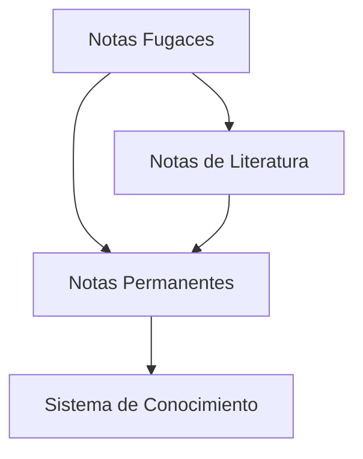

El método Zettelkasten define una estructura clara de diferentes tipos de notas, cada una con un propósito específico en el proceso de captura y desarrollo del conocimiento.

## Tipos principales

### 1. Notas Fugaces (Fleeting Notes)

Estas son las notas que capturas de cualquier lado, durante todo el día, las puedes escribir en un papel, en una nota de voz, en un PostIt, o en una aplicación de celular. 

Puede ser un pensamiento, algo que encontras en internet,  pueden ser sticky notes en un libro, algo que estabas pensando cuando leíste el libro.

![[Pasted image 20241118211513.png]]

![[Pasted image 20241118211455.png]]

- Captura rápida de ideas
- Notas temporales
- Sirven como memoria de trabajo
- Deben procesarse en 1-2 días
- Ejemplos:
	- Notas de reuniones
	- Ideas repentinas
	- Recordatorios
	- Notas de voz

En base a las Fleeting Notes --> Generamos las Permanent Notes

[[202411181447 Flujo de trabajo Zettelkasten]]

### 2. Notas de Literatura (Literature Notes)

- Resúmenes de fuentes
- Escritas con tus propias palabras
- Referencias claras a la fuente
- Base para notas permanentes
- Características:
	- Breves y concisas
	- Incluyen citas relevantes
	- Mantienen contexto original

### 3. Notas Permanentes (Permanent Notes)
- Ideas desarrolladas y refinadas
- Autocontenidas ([[202411181438 Principio de atomicidad en Zettelkasten]])
- Conectadas con el sistema existente
- Características:
	- Una idea por nota
	- Escritas para tu yo futuro
	- Referencias a notas relacionadas

## Flujo de trabajo

