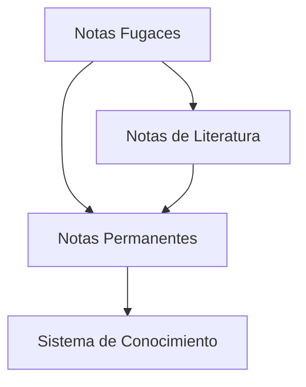

El método Zettelkasten define una estructura clara de diferentes tipos de notas, cada una con un propósito específico en el proceso de captura y desarrollo del conocimiento.

## Tipos de notas en Zettlekasten

- [[20241230T063646 Notas Fugaces (Fleeting Notes)]]
- [[Notas de Literatura]]
- [[20250102T2205 Notas Permanentes]]

### 3. Notas Permanentes (Permanent Notes)
- Ideas desarrolladas y refinadas
- Autocontenidas ([[20241228T0109 Principio de atomicidad en Zettelkasten]])
- Conectadas con el sistema existente
- Características:
	- Una idea por nota
	- Escritas para tu yo futuro
	- Referencias a notas relacionadas
### 3. Notas de Literatura (Literature Notes)

- Resúmenes de fuentes
- Escritas con tus propias palabras
- Referencias claras a la fuente
- Base para notas permanentes
- Características:
	- Breves y concisas
	- Incluyen citas relevantes
	- Mantienen contexto original

## Flujo de trabajo

